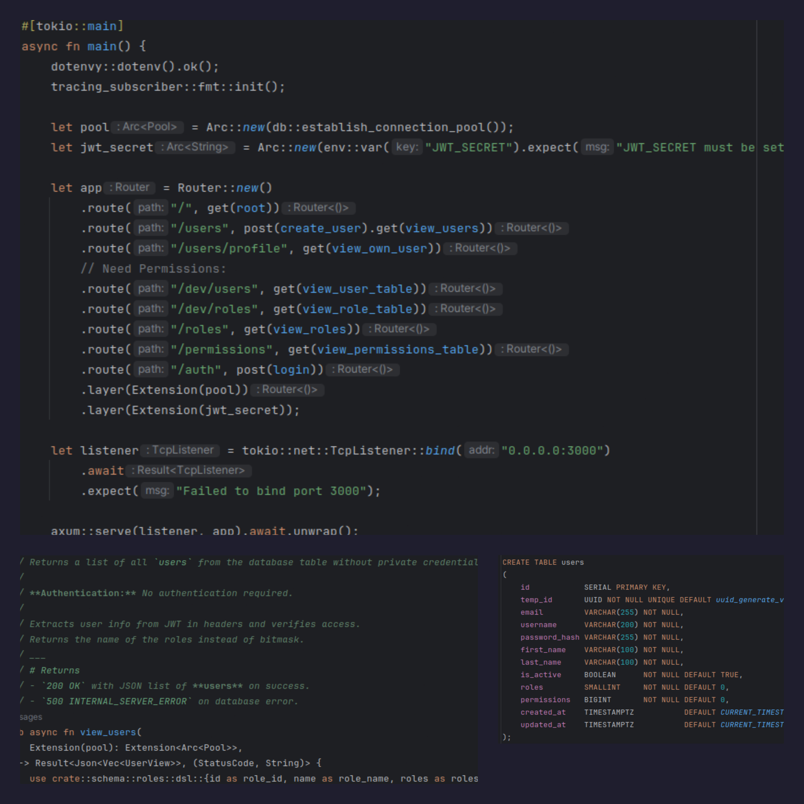

<h2 align="center"> ━━━━━━  ❖  ━━━━━━ </h2>

<!-- BADGES -->
<div align="center">

[](https://visitorbadge.io/status?path=https%3A%2F%2Fgithub.com%2Fzelvios%2Fuser_auth)
[](https://github.com/zelvios/user_auth/blob/main/LICENSE.md)

</div>

<h2></h2>

# user_auth

> [!NOTE]
> This project was created for learning purposes.  
> It is not production-ready and may be incomplete 
> or lack certain features, as it was built primarily 
> to explore and understand specific concepts.


## 🌿 <samp>About</samp>



A Rust-powered authentication API using Axum, Diesel, and PostgreSQL, with built-in connection pooling and Docker support.

Setup:

- Language: `rust`
- Web Framework: `axum`
- ORM: `diesel`
- Database: `postgresql`
- Connection Pool: `r2d2`
- Containerization: `docker`
- Password Hashing: `argon2`


### 🔐 Access Control
For details on role and permission mapping, see the [Access Control documentation](doc/access_control.md).

### 📡 API Reference
For details on available API endpoints, request and response, see the [API Reference](doc/api.md).


## 🔧  Setup Guide

1. Clone the repository:

    ```sh
    git clone https://github.com/Zelvios/user_auth
    ```

2. Enter the cloned repository:

    ```sh
    cd user_auth
    ```

3. Start the database with Docker Compose:

    ```
    docker-compose up -d db
    ```
4. Run the application:
    ```
    cargo run
    ```

### Or, as an oneliner:

```sh
git clone https://github.com/zelvios/user_auth.git && cd user_auth && docker-compose up -d db && cargo run
```
